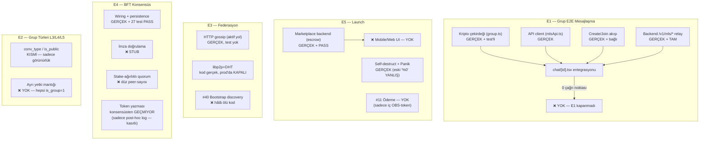

# Ground-Truth Denetimi — 2026-08-24

Git HEAD: `6e05e24` · Tam kanıt tablosu: `E:\obscura\docs\sessions\2026-08-24-ground-truth-audit.md`
İlişkili: [[Phase-Status]] · [[../../03_Resources/ADRs/Index|ADR Index]]

Metodoloji: tahmin yok, her madde dosya:satır kanıtlı, status etiketlerine güvenilmedi
(vault dahil — 2 madde bayat çıktı, bkz. altta). 5 paralel alt-denetim + kişisel
doğrulama (test çalıştırma, grep, kod okuma) birleştirildi.

## Şematik durum haritası

## Eşik skoru (özet — tam gerekçe ana rapor)

| Eşik | % | Durum |
|---|---|---|
| [[#E1 — Grup E2E]] | bileşen ~85-90% / **kullanıcı-erişilebilir %0** | 🔴 kapanmadı |
| [[#E2 — Grup Türleri]] | ~35-40% | 🟡 kavramsal, gerçek yetki yok |
| [[#E3 — Federasyon]] | ~40-45% | 🔴 #40 launch-blocker açık |
| [[#E4 — BFT]] | ~55-60% | 🟡 wiring sağlam, güvenlik stub |
| [[#E5 — Launch]] | ~40-45% | 🔴 marketplace UI + ödeme yok |

## 3 net launch-blocker

1. **E1** — `chat/[id].tsx` hiçbir MLS fonksiyonunu çağırmıyor (kripto/API/persistence hazır, entegrasyon eksik).
2. **#30 Marketplace UI** — backend escrow+dispute tam+test'li, mobile+web'de sıfır ekran.
3. **#40 P2P bootstrap** — `DiscoverBootstrapPeers` hâlâ 0 çağrı noktası, `docker-compose.yml` tüm node'larda `BOOTSTRAP_PEERS=""`.

**+ sessiz güven kırığı:** CI `-race` bayrağı taşıyor ama `CRYPTO_CLI_PATH`/`MLS_CLI_PATH`/`deno` set edilmediği için crypto-cli/mls-cli/sealed-sender testleri CI'da sessizce skip ediliyor — "PASS" görüntüsü bu testler için yanıltıcı.

## Status etiketi yalanı / bayat bulgular ([[Phase-Status]] içinde düzeltildi)

- FAZ3 madde 3 (BFT) "İZOLE İSKELET, ENTEGRE DEĞİL" — **yanlış**, `98466a4`'ten (2026-08-02) beri wiring+27 test tamam.
- FAZ3 madde 2 "libp2p... HTTP gossip'in yerini alıyor" — **yanlış**, prod compose'da libp2p kapalı.
- Marketplace escrow "KARAR VERİLDİ" notu — kod 5 adımın hepsini tamamlamış (2026-08-12), vault hiç güncellenmemiş.
- Eski "self-destruct/panik %0" notu — **yanlış**, ikisi de gerçek+test'li.
- `sealed_policy.go:14-19` içi yorum "chat'e bağlanmadı" diyor — kod artık bağlı, yorum bayat.

## Harita-dışı, dikkat çeken bulgular

- `backend/internal/umay/` — ~850 satır, tamamen ölü (main.go hiç başlatmıyor).
- `packages/e2ee/` — boş kabuk (`src/` fiziksel yok), gerçek E2EE `mobile/lib/e2e.ts`'te.
- `desktop/` (Tauri) — kod var, hiç derlenmemiş (`dlltool.exe` hatası, 2026-06-21'den beri çözülmemiş).
- `zk/` (üst-seviye) — muhtemelen ölü/yedek circuit seti, aktif zincir `circuits/`.

## Belirsiz kalanlar

#39 (repoda hiç iz yok) · bridge'in canlı zincir-üstü durumu (RPC gerektirir) · diğer
backend/internal paketlerinin çoğu (ai/airdrop/auth/bots/credit/dao/governance/identity/
media/moderation/push/scanner/signal/sms/storage/subscriber/pqcrypto/zk) sadece
wiring-seviyesinde tarandı, derin denetlenmedi · #12'nin 22/23 maddesi doğrulanmadı.

---
*Tam kanıt tablosu (dosya:satır, tüm testler, tam metodoloji): `docs/sessions/2026-08-24-ground-truth-audit.md`*
